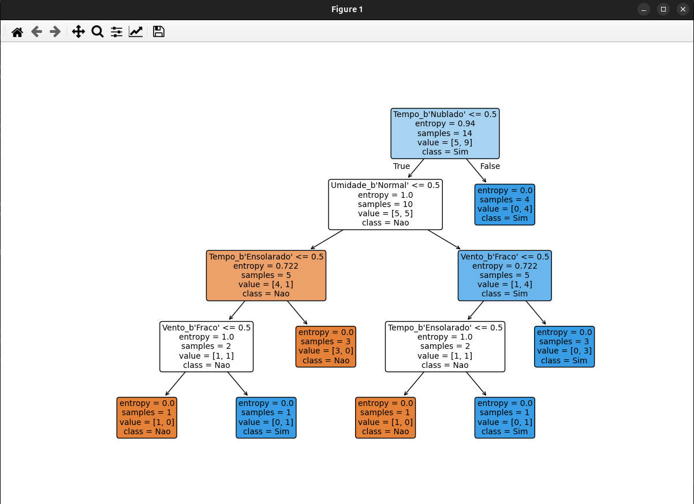

## Comandos para rodar:

## Linux: 
> python3 -m venv venv

> source venv/bin/activate

> pip install -r requirements.txt

> python3 linux.py

## Windows: 
> python -m venv venv

> Venv/Scripts/Activate

> pip install -r requirements.txt

> python windows.py

## Resultado:

